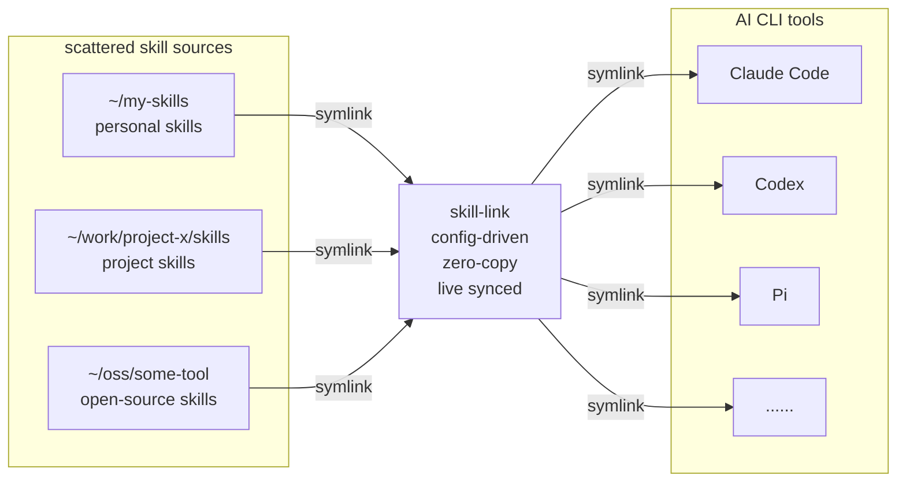

# AI Skill Link

[中文文档](README.md)

A cross-platform tool that bridges AI CLI tools to your skills — wherever they live — via symbolic links.

## 1. What is This?

Skills for AI coding tools are inherently scattered: your personal skill repo, a project's built-in skills directory, an open-source tool's bundled skills, your team's shared skill collection. They live in different sources, different directories, different machines.

**AI Skill Link doesn't ask you to copy them into a central store.** Instead, it creates symbolic links directly from wherever your skills live into each AI CLI tool's skills directory. Skills stay put. Changes propagate instantly. No duplication.



**How it works:**

1. You define where your skills live — put paths in a config file
2. skill-link scans those directories for skill folders (any dir with `SKILL.md`)
3. It creates symlinks from each AI CLI tool's skills directory back to the originals

No central store. No copies. Skills stay in their natural homes — git sources, project folders, shared drives — and every AI CLI tool reads from the same source via symlinks.

**Typical Setup:**

```
~/.config/ai-skill-link/
  └── config               # Your user config (one file)

~/my-skills/               # Your personal skills
  ├── skill-1/
  │   └── SKILL.md
  └── skill-2/
      └── SKILL.md

~/work/project-x/skills/   # A project's built-in skills
  └── ci-deploy/
      └── SKILL.md

~/.claude/skills/          # AI CLI skills directory (managed by tool)
  ├── skill-1 -> ~/my-skills/skill-1        # Symlink to personal repo
  ├── skill-2 -> ~/my-skills/skill-2        # Symlink to personal repo
  └── ci-deploy -> ~/work/project-x/skills/ci-deploy  # Symlink to project
```

## 2. Project Goals

AI CLI tools each have their own skills configuration system. Skills are scattered across personal sources, project directories, team collections, and open-source distributions. Copying them around creates drift and duplication.

AI Skill Link replaces copying with bridging. Config-driven, zero-copy, live-synced.

**Key Benefits:**

- **Skills Stay Distributed**: No central store required — point at multiple sources and directories, they all bridge into your tools
- **Instantly Live**: Edit a skill in its original repo, every AI CLI sees the change immediately (it's a symlink)
- **Zero Duplication**: One canonical copy per skill, symlinked everywhere it's needed
- **Multi-Source Aggregation**: Gather skills from personal, work, open-source, and project repos into one unified view
- **Space Efficient**: Symlinks avoid duplicate files across AI CLI directories

## 3. Usage

### 3.1 Installation

```bash
npm install -g ai-skill-link
```

Requires Node.js >= 18.

### 3.2 Initial Setup

1. **Register your source directories:**

   The easiest way — register your skills directories into the user config with a command, no hand-editing:

   ```bash
   # Register one or more scattered skills dirs (written to ~/.config/ai-skill-link/config.conf)
   skill-link --add-source ~/my-skills ~/work/project-x/skills ~/oss/awesome-tools/skills

   # Show configured sources
   skill-link --list-sources
   ```

   `--add-source` auto-names each directory: when the leaf is `skills` it uses the parent name (`.../project-x/skills` → `project-x`), otherwise the leaf name (`~/my-skills` → `my-skills`). Name conflicts get a suffix, duplicate paths are skipped, and missing directories error out.

   `--dry-run` preview and `--remove-source <name...>` are also supported:

   ```bash
   skill-link --add-source ~/more-skills --dry-run   # preview, no file changes
   skill-link --remove-source project-x              # remove by name
   ```

   > Prefer hand-editing? The user config lives at `~/.config/ai-skill-link/config.conf`, INI format, overriding built-in defaults; it sits outside the package directory so `npm update` never touches it.

2. **Link your skills:**

   ```bash
   # Link all skills to all configured tools
   skill-link --all --cli all
   ```

### 3.3 Quick Start

```bash
# List available skills from all configured sources
skill-link --list

# List all supported CLI tools and their target paths
skill-link --list-clis

# Link all skills from all sources to all configured tools
skill-link --all --cli all

# Link a single skill to a specific tool (auto-searches all sources)
skill-link skill-link-example --cli claude-code

# Run health checks on all CLI tool skill directories
skill-link --doctor

# Link skills to a specific project instead of global
skill-link --all --cli claude-code --project .

# Link a project's own skills into that same project
skill-link my-skill --cli claude-code --source ./skills --project .

skill-link --all --cli claude-code --project .
```


### 3.4 Typical Scenarios

**Scenario 1: Managing a Personal Skill Collection**

You maintain a personal skill repo at `~/my-skills` and want all AI CLI tools to use it. Configure once, link everywhere:

```bash
# 1. Register the source dir (written to ~/.config/ai-skill-link/config.conf)
skill-link --add-source ~/my-skills

# 2. Link all skills to every configured tool
skill-link --all --cli all
```

After adding or editing a skill, re-run `skill-link --all --cli all` — all tools pick up changes instantly.

**Scenario 1.5: Aggregating Scattered Skills Dirs into the Default Lookup**

Your skills are spread across multiple repos / projects / open-source dirs. You don't want to copy them into one place, and you don't want to pass `--source` every time. Register them all as sources in one command — `--all` aggregates across every source:

```bash
# Register multiple scattered dirs at once
skill-link --add-source ~/my-skills ~/work/project-x/skills ~/oss/awesome-tools/skills

# Show registered sources
skill-link --list-sources

# Link every skill from every source to all tools
skill-link --all --cli all
```

Add new sources anytime; remove one with `skill-link --remove-source <name>` when no longer needed.

**Scenario 2: Self-Contained Project Skills**

Your project `~/work/my-app` has its own skills in `./skills/`. You want them available only within the project, not globally.

```bash
cd ~/work/my-app
skill-link my-skill --cli codex --source ./skills --project .
```

`--source ./skills` sets the source; `--project .` installs into the project's `.codex/skills/`. Team members run it once after cloning.

**Scenario 3: Integrating Open-Source Skills**

An open-source project has useful skills you want to use without copying. Symlinks keep you in sync with upstream.

```bash
skill-link ci-automation --cli codex --source ~/oss/awesome-tools/skills
```

**Scenario 4: Preview, Then Execute**

Not sure what will change? Dry-run first:

```bash
skill-link --all --cli all --dry-run
# Review, then remove --dry-run to apply
skill-link --all --cli all
```

**Scenario 5: Cleanup & Migration**

Removing a skill or moving it between projects:

```bash
# Unlink globally
skill-link old-skill --cli codex --unlink

# Unlink from old project
skill-link old-skill --cli codex --project ~/work/old-project --unlink

# Link in new project
skill-link old-skill --cli codex --source ./skills --project ~/work/new-project
```

**Scenario 6: Routine Health Checks**

Symlinks can break or duplicate over time. Run periodic checks to keep things clean:

```bash
skill-link --doctor --verbose

# Re-link to fix broken symlinks
skill-link --all --cli all --force
```

### 3.5 Common Commands

```bash
# List skills from a specific source
skill-link --list --source work

# Link a skill (auto-searches all sources)
skill-link skill-link-example --cli claude-code

# Link a skill from a specific source
skill-link skill-link-example --source work --cli claude-code

# Link a single skill to all tools
skill-link skill-link-example --cli all

# Preview mode (no changes)
skill-link --all --cli all --dry-run

# Link all skills from a specific repo to all tools
skill-link --all --source work --cli all

# Force overwrite existing targets
skill-link skill-link-example --cli claude-code --force

# Remove linked skills
skill-link skill-link-example --cli claude-code --unlink

# Remove all linked skills from all sources (all tools)
skill-link --all --cli all --unlink

# Create relative symlinks
skill-link skill-link-example --cli claude-code --relative

# Run health checks (broken symlinks, duplicates, missing SKILL.md)
skill-link --doctor

# Health checks on specific tool only
skill-link --doctor --cli claude-code

# Health checks in verbose mode (includes unlinked skill detection)
skill-link --doctor --verbose

# Link skills to a specific project directory
skill-link skill-link-example --cli claude-code --project ~/work/my-app

# Link a project's own skills into that same project
skill-link my-skill --cli claude-code --source ./skills --project .

# Link all skills to a project (--project . for current directory)
skill-link --all --cli all --project .

# Health checks on project-level links
skill-link --doctor --project ~/work/my-app

# Unlink from project
skill-link skill-link-example --cli claude-code --project ~/work/my-app --unlink

# Manage sources: register scattered skills directories
skill-link --add-source ~/my-skills ~/work/project-x/skills
skill-link --list-sources
skill-link --remove-source project-x
skill-link --add-source ~/more-skills --dry-run
```

### 3.6 Multi-Source Behavior

**Default behavior (no `--source` specified):**
- `--list`: Shows skills from **all** configured sources
- `--all`: Links skills from **all** configured sources
- Manual skill names: **Auto-searches across all sources**

**With `--source <name>`:**
- Only operates on the specified source
- Useful when you have duplicate skill names in different sources

**Priority order:** When a skill exists in multiple sources, the first match is used (source order in config).

### 3.7 Health Checks (`--doctor`)

The `--doctor` command scans all configured CLI tool directories and skill sources, reporting issues without making changes:

| Check | Status | Description |
|-------|--------|-------------|
| Broken symlinks | `[BROKEN]` | Symlink points to a target that no longer exists |
| Orphan directories | `[ORPHAN]` | Non-symlink directory in a CLI skills dir (may be a stale copy) |
| Duplicate skills | `[DUPLICATE]` | Same skill name found in multiple sources |
| Invalid SKILL.md | `[INVALID]` | SKILL.md is missing or empty in a skill directory |
| Unlinked skills | `[UNLINKED]` | (verbose only) Skill exists in a source but not linked to any CLI |

```bash
# Full health check across all tools and sources
skill-link --doctor

# Check only a specific CLI tool
skill-link --doctor --cli claude-code

# Also report unlinked skills
skill-link --doctor --verbose

# Check project-level links
skill-link --doctor --project ~/work/my-app
```

Exit code is 0 when all checks pass, non-zero when issues are found.

### 3.8 Project-Level Linking (`--project`)

By default, skills are linked to global CLI tool directories (e.g., `~/.claude/skills/`). Use `--project` to link into a project-local directory instead — useful when you want project-specific skills that shouldn't be available globally.

**How it works:** The CLI tool's configured path (e.g., `~/.claude/skills`) has `~` replaced with the project directory:

```
Global:    ~/.claude/skills/<skill>
Project:   ~/work/my-app/.claude/skills/<skill>
```

```bash
# Link all skills into current project
skill-link --all --cli claude-code --project .

# Link a skill to a specific project
skill-link my-skill --cli claude-code --project ~/work/my-app

# Dry-run first
skill-link --all --cli all --project . --dry-run

# Unlink from project
skill-link --all --cli claude-code --project . --unlink
```

`--project` accepts any path (`.`, `./subdir`, `../sibling`, absolute paths). The directory must exist.

### 3.9 Parameters

| Parameter | Short | Description |
|-----------|-------|-------------|
| `--cli <name>` | `-c` | Target tool name (required for link/unlink), `all` for all configured tools |
| `--all` | `-a` | Operate on all skills in source (mutually exclusive with explicit skill names) |
| `--unlink` | `-u` | Remove symlinks instead of creating them |
| `--dry-run` | `-n` | Preview mode, don't actually modify files |
| `--force` | `-f` | Force overwrite if target exists |
| `--relative` | | Create relative path symlinks |
| `--source <dir>` | `-s` | Specify skill source (name or path) |
| `--project <dir>` | `-p` | Target a project-level skills directory instead of global (replaces `~` in CLI path) |
| `--doctor` | `-D` | Run health checks (broken symlinks, duplicates, missing SKILL.md) |
| `--list` | `-l` | List available skills in source |
| `--list-clis` | | List configured CLI tools and their directories |
| `--add-source <path...>` | | Register one or more skills dirs as named sources (writes user config; no `--cli` needed) |
| `--remove-source <name...>` | | Remove sources by name (no `--cli` needed) |
| `--list-sources` | | List configured sources and their dirs (no `--cli` needed) |
| `--verbose` | `-v` | Print extra logs (with `--doctor`: also report unlinked skills) |
| `--help` | `-h` | Show help information |

### 3.10 Configuration

Configuration is layered:

| Source | Location | Description |
|--------|----------|-------------|
| Built-in | `config.conf` (in package) | Ships with npm, includes 24 AI CLI tools. Updated with `npm update`. |
| User | `~/.config/ai-skill-link/config.conf` | Your custom overrides. Never touched by updates. |

User config entries override built-in ones with the same name.

**Configuration Format:**

```ini
[source]
default = ~/my-skills
work    = ~/work-skills
oss     = ~/opensource-skills

[clis]
cursor  = ~/.cursor/skills
my-tool = ~/path/to/my-tool/skills
```

**[source] Configuration:**

Supports multiple named sources for organizing skills from different sources (personal, team, open-source, etc.):

- `default`: Optional. Used as the source root when `--source` is not specified. When omitted, skills are looked up across all named sources.
- Other names: Custom named sources, referenced via `--source <name>`, and aggregated for `--all` / `--list` / by-name lookup.
- Usage examples:
  - `skill-link --list` → lists skills from `default` (or all named sources when `default` is absent)
  - `skill-link --list --source work` → uses named source `work`
  - `skill-link --list --source /tmp/test` → uses temporary path
  - `skill-link skill-a --cli claude-code` → finds `skill-a` across all named sources (no `default` needed)
- Priority: command-line `--source` > config `[source] default` > multi-source by-name lookup

**[clis] Configuration:**

Defines AI CLI tools and their skills directory paths:

- `~` automatically expands to user home directory
- Run `skill-link --list-clis` to see current merged list
- `skill-link --cli all` operates on all configured CLI tools

### 3.11 Exit Codes

| Code | Meaning |
|------|---------|
| `0` | All successful |
| `1` | Parameter error (e.g., missing `--cli`) |
| `2` | Skill not found or no valid `SKILL.md` |
| `3` | Target conflict (exists and `--force` not used) |
| `4` | Other link failures |
