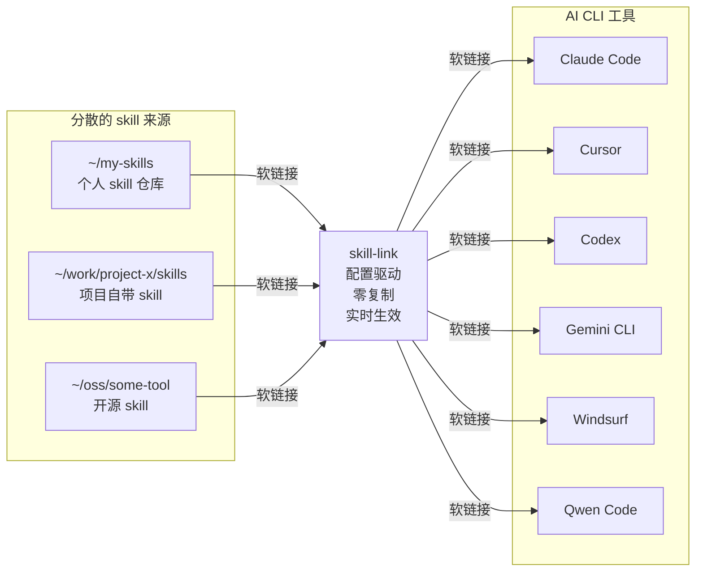

# AI Skill Link

[English](README.en.md) | 中文

一个跨平台的 AI CLI skills 桥接工具——通过软链接，把你的 skills 从各自的"老家"直接桥接到各个 AI 工具。

## 1. 这是什么？

AI 编程工具的 skills 天生是分散的：个人的 skill 仓库、项目自带的 skills 目录、开源工具的 skills、团队共享的 skill 集合……它们散落在不同来源、不同目录、不同机器上。

**AI Skill Link 不要求你把它们拷贝到一个中央存储。** 它直接从 skills 原所在位置创建软链接到各个 AI CLI 工具的 skills 目录。Skills 留在原处不动，修改实时生效，零冗余。



**工作方式：**

1. 在配置文件中声明你的 skills 散落在哪些目录
2. skill-link 扫描这些目录，找到所有包含 `SKILL.md` 的 skill 目录
3. 在每个 AI CLI 工具的 skills 目录下创建软链接，指向原始位置

没有中央存储，没有拷贝。Skills 留在它们自然存在的地方——git 仓库、项目目录、共享盘——所有 AI CLI 工具通过软链接读取同一份源文件。

**典型配置：**

```
~/.config/ai-skill-link/
  └── config               # 你的用户配置（一个文件）

~/my-skills/               # 你的个人 skills
  ├── skill-1/
  │   └── SKILL.md
  └── skill-2/
      └── SKILL.md

~/work/project-x/skills/   # 项目自带的 skills
  └── ci-deploy/
      └── SKILL.md

~/.claude/skills/          # AI CLI skills 目录（由工具管理）
  ├── skill-1 -> ~/my-skills/skill-1        # 软链接到个人仓库
  ├── skill-2 -> ~/my-skills/skill-2        # 软链接到个人仓库
  └── ci-deploy -> ~/work/project-x/skills/ci-deploy  # 软链接到项目
```

## 2. 项目目标

AI CLI 工具各有各的 skills 配置系统。Skills 散落在个人仓库、项目目录、团队集合、开源分发中。来回拷贝会产生内容漂移和冗余。

AI Skill Link 用桥接取代拷贝——配置驱动、零冗余、实时同步。

**核心优势：**

- **Skills 留在原处**：不需要中央存储，指到多个仓库和目录，统一桥接到你的 AI 工具
- **改动即时生效**：在原仓库修改 skill，所有 AI CLI 立刻看到变化（因为是软链接）
- **零冗余**：每个 skill 只有一份本体，通过软链接出现在所有需要它的地方
- **多来源聚合**：把个人、工作、开源、项目来源的 skills 汇聚到一个统一视图
- **节省空间**：软链接避免在多个 AI CLI 目录中重复存储相同文件

## 3. 使用方法

### 3.1 安装

```bash
npm install -g ai-skill-link
```

需要 Node.js >= 18。

### 3.2 初始设置

1. **注册来源目录：**

   最简单的方式——用命令把你的 skills 目录注册进用户配置，无需手编文件：

   ```bash
   # 注册一个或多个分散的 skills 目录（路径会写入 ~/.config/ai-skill-link/config.conf）
   skill-link --add-source ~/my-skills ~/work/project-x/skills ~/oss/awesome-tools/skills

   # 查看已配置的来源
   skill-link --list-sources
   ```

   `--add-source` 会为每个目录自动起名：叶子目录叫 `skills` 时取父目录名（`.../project-x/skills` → `project-x`），否则取叶子名（`~/my-skills` → `my-skills`）。重名自动加后缀，路径重复会跳过，目录不存在会报错。

   也支持 `--dry-run` 预览、`--remove-source <name...>` 移除：

   ```bash
   skill-link --add-source ~/more-skills --dry-run   # 预览，不写文件
   skill-link --remove-source project-x              # 按名字移除
   ```

   > 如果更习惯手编：用户配置位于 `~/.config/ai-skill-link/config.conf`，INI 格式，条目覆盖内置默认值；该文件在 npm 包目录之外，`npm update` 永远不会触及。

2. **链接你的 skills：**

   ```bash
   # 将所有 skills 链接到所有已配置的工具
   skill-link --all --cli all
   ```

### 3.3 快速开始

```bash
# 查看所有已配置来源中的可用 skill
skill-link --list

# 查看所有支持的 CLI 工具及其目标路径
skill-link --list-clis

# 将所有来源的全部 skill 链接到所有已配置的工具
skill-link --all --cli all

# 链接单个 skill 到指定工具（自动在所有来源中查找）
skill-link skill-link-example --cli claude-code

# 对所有 CLI 工具 skill 目录做健康检查
skill-link --doctor

# 链接到指定项目而非全局目录
skill-link --all --cli claude-code --project .

# 将当前项目的 skills 安装到当前项目
skill-link my-skill --cli claude-code --source ./skills --project .

skill-link --all --cli claude-code --project .
```


### 3.4 典型使用场景

**场景一：管理个人 skills 合集**

你维护了一个个人 skills 仓库 `~/my-skills`，希望所有 AI CLI 工具都能使用。一次配置，全局生效：

```bash
# 1. 注册来源目录（写入 ~/.config/ai-skill-link/config.conf）
skill-link --add-source ~/my-skills

# 2. 一次性链接所有 skills 到所有工具
skill-link --all --cli all
```

之后新增或修改 skill，只需重新执行 `skill-link --all --cli all`，所有工具立即生效。

**场景 1.5：把分散的多个 skills 目录聚合到默认查找范围**

你的 skills 散落在多个仓库 / 项目 / 开源目录，不想拷到一处，也不想每次都指定 `--source`。一条命令把它们都注册成来源，`--all` 会聚合扫描全部来源：

```bash
# 一次性注册多个分散目录
skill-link --add-source ~/my-skills ~/work/project-x/skills ~/oss/awesome-tools/skills

# 查看已注册来源
skill-link --list-sources

# 链接所有来源的全部 skill 到所有工具
skill-link --all --cli all
```

新增来源随时追加；不再需要的可 `skill-link --remove-source <name>` 移除。

**场景二：项目自带 skills 的闭环使用**

项目 `~/work/my-app` 维护了一套专属 skills（放在 `./skills/` 下），只想在该项目中使用，不污染全局。

```bash
cd ~/work/my-app
skill-link my-skill --cli codex --source ./skills --project .
```

`--source ./skills` 指定来源，`--project .` 安装到当前项目的 `.codex/skills/`。团队成员 clone 后各人运行一次即可。

**场景三：接入开源或第三方的 skills**

开源项目自带的 skills 不想拷贝，直接软链接引用，上游更新自动同步。

```bash
skill-link ci-automation --cli codex --source ~/oss/awesome-tools/skills
```

**场景四：先预览，再执行**

不确定操作会影响哪些文件？用 `--dry-run` 先看：

```bash
skill-link --all --cli all --dry-run
# 确认无误后去掉 --dry-run 正式执行
skill-link --all --cli all
```

**场景五：清理和迁移**

不再需要某个 skill，或从一个项目迁移到另一个项目：

```bash
# 删除全局链接
skill-link old-skill --cli codex --unlink

# 从旧项目取消链接
skill-link old-skill --cli codex --project ~/work/old-project --unlink

# 在新项目中链接
skill-link old-skill --cli codex --source ./skills --project ~/work/new-project
```

**场景六：定期健康诊断**

软链接多了容易出断链或重复，定期检查保持整洁：

```bash
skill-link --doctor --verbose

# 发现断链后，用 --force 重新链接修复
skill-link --all --cli all --force
```

### 3.5 常用命令

```bash
# 查看指定来源的 skill
skill-link --list --source work

# 链接 skill（自动在所有来源中查找）
skill-link skill-link-example --cli claude-code

# 从指定来源链接 skill
skill-link skill-link-example --source work --cli claude-code

# 链接单个 skill 到所有工具
skill-link skill-link-example --cli all

# 预览模式（不实际修改文件）
skill-link --all --cli all --dry-run

# 只链接指定来源的全部 skill 到所有工具
skill-link --all --source work --cli all

# 强制覆盖已有同名目标
skill-link skill-link-example --cli claude-code --force

# 删除已链接的 skill
skill-link skill-link-example --cli claude-code --unlink

# 删除所有来源的全部已链接 skill（所有工具）
skill-link --all --cli all --unlink

# 创建相对路径符号链接
skill-link skill-link-example --cli claude-code --relative

# 运行健康检查（断链、重复、缺失 SKILL.md）
skill-link --doctor

# 仅检查特定 CLI 工具
skill-link --doctor --cli claude-code

# 健康检查 + 详细模式（包含未链接 skill 检测）
skill-link --doctor --verbose

# 链接到指定项目目录
skill-link skill-link-example --cli claude-code --project ~/work/my-app

# 将当前项目的 skills 安装到当前项目
skill-link my-skill --cli claude-code --source ./skills --project .

# 链接全部 skill 到当前项目（--project . 表示当前目录）
skill-link --all --cli all --project .

# 检查项目级链接的健康状况
skill-link --doctor --project ~/work/my-app

# 从项目中取消链接
skill-link skill-link-example --cli claude-code --project ~/work/my-app --unlink

# 管理来源：注册分散的 skills 目录
skill-link --add-source ~/my-skills ~/work/project-x/skills
skill-link --list-sources
skill-link --remove-source project-x
skill-link --add-source ~/more-skills --dry-run
```

### 3.6 多来源行为说明

**默认行为（不指定 `--source`）：**
- `--list`：显示**所有**已配置来源的 skill
- `--all`：链接**所有**已配置来源的 skill
- 手动指定 skill 名称：**自动在所有来源中查找**

**使用 `--source <名称>` 时：**
- 仅操作指定的仓库
- 适用于不同仓库有同名 skill 的情况

**优先级顺序：** 当多个仓库包含同名 skill 时，使用第一个匹配的（按配置文件中仓库顺序）。

### 3.7 健康检查（`--doctor`）

`--doctor` 命令扫描所有已配置的 CLI 工具目录和 skill 仓库，报告问题但不做任何修改：

| 检查项 | 状态标签 | 说明 |
|--------|----------|------|
| 断开的软链接 | `[BROKEN]` | 软链接指向的目标已不存在 |
| 孤立目录 | `[ORPHAN]` | CLI skills 目录中的非软链接目录（可能是手动拷贝的残留） |
| 重复 skill | `[DUPLICATE]` | 同名 skill 出现在多个仓库中 |
| 无效 SKILL.md | `[INVALID]` | skill 目录中的 SKILL.md 缺失或为空 |
| 未链接的 skill | `[UNLINKED]` | （仅 verbose 模式）仓库中有但未链接到任何 CLI 的 skill |

```bash
# 全面健康检查
skill-link --doctor

# 仅检查特定 CLI 工具
skill-link --doctor --cli claude-code

# 同时显示未被链接的 skill
skill-link --doctor --verbose

# 检查项目级链接的健康状况
skill-link --doctor --project ~/work/my-app
```

退出码为 0 表示一切正常，非 0 表示发现问题。

### 3.8 项目级链接（`--project`）

默认情况下，skill 会链接到全局 CLI 工具目录（如 `~/.claude/skills/`）。使用 `--project` 可以将 skill 链接到项目本地目录——适用于只想在特定项目中使用的 skill。

**工作原理：** 将 CLI 工具配置路径中的 `~` 替换为项目目录：

```
全局：  ~/.claude/skills/<skill>
项目：  ~/work/my-app/.claude/skills/<skill>
```

```bash
# 链接全部 skill 到当前项目
skill-link --all --cli claude-code --project .

# 链接单个 skill 到指定项目
skill-link my-skill --cli claude-code --project ~/work/my-app

# 先预览再执行
skill-link --all --cli all --project . --dry-run

# 从项目中取消链接
skill-link --all --cli claude-code --project . --unlink
```

`--project` 接受任意路径（`.`、`./subdir`、`../sibling`、绝对路径均可），目录必须存在。

### 3.9 参数说明

| 参数 | 简写 | 说明 |
|------|------|------|
| `--cli <name>` | `-c` | 目标工具名称（链接/取消链接时必填），`all` 表示所有已配置工具 |
| `--all` | `-a` | 操作仓库内全部 skill（与显式指定 skill 名互斥） |
| `--unlink` | `-u` | 删除软链接而非创建 |
| `--dry-run` | `-n` | 预览模式，不实际修改文件 |
| `--force` | `-f` | 目标已存在时强制覆盖 |
| `--relative` | | 创建相对路径软链接 |
| `--source <dir>` | `-s` | 指定 skill 仓库（命名 repo 或路径） |
| `--project <dir>` | `-p` | 链接到项目级 skill 目录而非全局（将 CLI 路径中的 `~` 替换为项目路径） |
| `--doctor` | `-D` | 运行健康检查（断链、重复 skill、缺失 SKILL.md） |
| `--list` | `-l` | 列出仓库中的可用 skill |
| `--list-clis` | | 列出已配置的 CLI 工具及其目录 |
| `--add-source <path...>` | | 注册一个或多个 skills 目录为命名来源（写入用户配置，无需 `--cli`） |
| `--remove-source <name...>` | | 按名字移除来源（无需 `--cli`） |
| `--list-sources` | | 列出已配置的来源及其目录（无需 `--cli`） |
| `--verbose` | `-v` | 打印额外日志（配合 `--doctor` 时同时报告未链接的 skill） |
| `--help` | `-h` | 显示帮助信息 |

### 3.10 配置说明

配置分两层：

| 来源 | 位置 | 说明 |
|------|------|------|
| 内置 | `config.conf`（npm 包内） | 随 npm 包发布，内置 22 个 AI CLI 工具。随 `npm update` 自动更新。 |
| 用户 | `~/.config/ai-skill-link/config.conf` | 你的自定义覆盖配置。更新永远不会触及。 |

用户配置中同名条目优先级更高。

**配置格式：**

```ini
[source]
default = ~/my-skills
work    = ~/work-skills
oss     = ~/opensource-skills

[clis]
cursor  = ~/.cursor/skills
my-tool = ~/path/to/my-tool/skills
```

**[source] 配置说明：**

支持多个命名 repo，用于组织不同来源的 skills（个人、团队、开源等）：

- `default`：特殊名称，表示不指定 `--source` 参数时使用的默认来源
- 其他名称：自定义命名 repo，通过 `--source <name>` 引用
- 使用示例：
  - `skill-link --list` → 使用 `default` repo
  - `skill-link --list --source work` → 使用命名 repo `work`
  - `skill-link --list --source /tmp/test` → 使用临时路径
- 优先级：命令行 `--source` > 配置 `[source] default`

**[clis] 配置说明：**

定义 AI CLI 工具及其 skills 目录路径：

- `~` 自动展开为用户主目录
- 运行 `skill-link --list-clis` 查看当前合并后的完整列表
- `skill-link --cli all` 会操作所有已配置的 CLI 工具

### 3.11 返回码

| 代码 | 含义 |
|------|------|
| `0` | 全部成功 |
| `1` | 参数错误（如缺少 `--cli`） |
| `2` | skill 不存在或无有效 `SKILL.md` |
| `3` | 目标冲突（已存在且未使用 `--force`） |
| `4` | 其他链接失败 |
