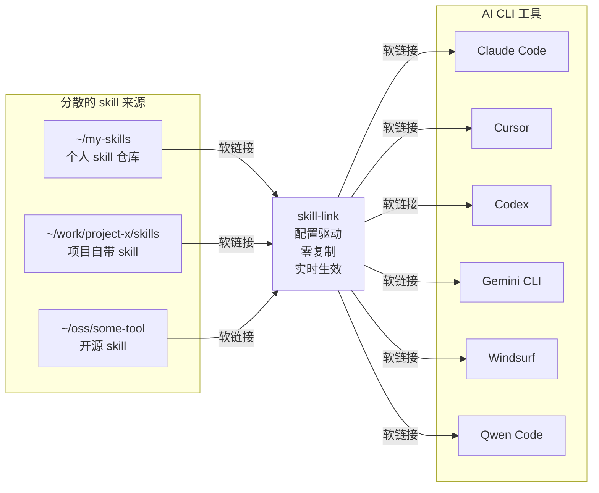

# AI Skill Link

[English](README.md) | 中文

一个跨平台的 AI CLI skills 桥接工具——通过软链接,把你的 skills 从各自的"老家"直接桥接到各个 AI 工具。

## 这是什么？

AI 编程工具的 skills 天生是分散的:个人的 skill 仓库、项目自带的 skills 目录、开源工具的 skills、团队共享的 skill 集合……它们散落在不同仓库、不同目录、不同机器上。

**AI Skill Link 不要求你把它们拷贝到一个中央存储。** 它直接从 skills 原所在位置创建软链接到各个 AI CLI 工具的 skills 目录。Skills 留在原处不动,修改实时生效,零冗余。



**工作方式:**

1. 在配置文件中声明你的 skills 散落在哪些目录
2. skill-link 扫描这些目录,找到所有包含 `SKILL.md` 的 skill 目录
3. 在每个 AI CLI 工具的 skills 目录下创建软链接,指向原始位置

没有中央存储,没有拷贝。Skills 留在它们自然存在的地方——git 仓库、项目目录、共享盘——所有 AI CLI 工具通过软链接读取同一份源文件。

**典型配置:**

```
~/ai-skill-link/          # 本工具(克隆一次)
  ├── skill-link          # 链接脚本
  ├── skill-link.conf     # 默认配置
  └── ...

~/my-skills/              # 你的个人 skills
  ├── skill-1/
  │   └── SKILL.md
  └── skill-2/
      └── SKILL.md

~/work/project-x/skills/  # 项目自带的 skills
  └── ci-deploy/
      └── SKILL.md

~/.claude/skills/         # AI CLI skills 目录(由工具管理)
  ├── skill-1 -> ~/my-skills/skill-1        # 软链接到个人仓库
  ├── skill-2 -> ~/my-skills/skill-2        # 软链接到个人仓库
  └── ci-deploy -> ~/work/project-x/skills/ci-deploy  # 软链接到项目
```

## 项目目标

AI CLI 工具各有各的 skills 配置系统。Skills 散落在个人仓库、项目目录、团队集合、开源分发中。来回拷贝会产生内容漂移和冗余。

AI Skill Link 用桥接取代拷贝——配置驱动、零冗余、实时同步。

**核心优势:**

- **Skills 留在原处**: 不需要中央存储,指到多个仓库和目录,统一桥接到你的 AI 工具
- **改动即时生效**: 在原仓库修改 skill,所有 AI CLI 立刻看到变化(因为是软链接)
- **零冗余**: 每个 skill 只有一份本体,通过软链接出现在所有需要它的地方
- **多仓库聚合**: 把个人、工作、开源、项目仓库的 skills 汇聚到一个统一视图
- **节省空间**: 软链接避免在多个 AI CLI 目录中重复存储相同文件

## 项目结构

```
ai-skill-link/
├── skill-link-example/       # 示例 skill：介绍本工具的用途和用法
│   └── SKILL.md              # 技能定义文件
├── skill-link                # Bash 脚本（macOS/Linux）
├── skill-link.ps1            # PowerShell 脚本（Windows）
├── skill-link.bat            # 批处理文件（Windows，推荐普通用户使用）
├── skill-link.conf           # 默认 CLI 配置（随仓库提交）
└── README.md                 # 本文件
```

每个 skill 是一个包含 `SKILL.md` 的目录，可选包含 `agents/`、`references/` 等子目录：

```
your-skill-name/
├── SKILL.md              # 必需：技能定义文件
├── agents/               # 可选：AI 代理配置
└── references/           # 可选：参考文档
```

## 使用方法

### 初始设置

1. **克隆本工具仓库：**
   ```bash
   git clone <this-repo-url> ~/ai-skill-link
   cd ~/ai-skill-link
   ```

2. **配置你的 skills 仓库：**
   
   创建 `skill-link.local.conf` 指向你的实际 skills 仓库：
   
   ```bash
   cat > skill-link.local.conf <<'EOF'
   [repo]
   default = ~/my-skills
   
   [clis]
   # 如需要可添加自定义 CLI 工具
   cursor = ~/.cursor/skills
   EOF
   ```

3. **链接你的 skills：**
   ```bash
   # 将所有 skills 链接到所有已配置的工具
   ./skill-link --all --cli all
   ```

### 快速开始

```bash
# 查看所有已配置仓库中的可用 skill
./skill-link --list

# 将所有仓库的全部 skill 链接到所有已配置的工具
./skill-link --all --cli all

# 链接单个 skill 到指定工具（自动在所有仓库中查找）
./skill-link skill-link-example --cli claude-code
```

### macOS / Linux（Bash）

命令格式：

```bash
./skill-link <skill_name...> --cli <name> [options]
./skill-link --all --cli <name> [options]
```

常用示例：

```bash
# 查看所有已配置仓库的 skill
./skill-link --list

# 查看指定仓库的 skill
./skill-link --list --repo default
./skill-link --list --repo work

# 查看已配置的 AI CLI 工具
./skill-link --list-clis

# 链接 skill（自动在所有仓库中查找）
./skill-link skill-link-example --cli claude-code

# 从指定仓库链接 skill
./skill-link skill-link-example --repo work --cli claude-code

# 链接单个 skill 到所有工具
./skill-link skill-link-example --cli all

# 链接所有仓库的全部 skill 到所有工具（预览模式）
./skill-link --all --cli all --dry-run

# 只链接指定仓库的全部 skill 到所有工具
./skill-link --all --repo work --cli all

# 链接所有仓库的全部 skill 到所有工具（实际执行）
./skill-link --all --cli all

# 强制覆盖已有同名目标
./skill-link skill-link-example --cli claude-code --force

# 删除已链接的 skill
./skill-link skill-link-example --cli claude-code --unlink

# 删除所有仓库的全部已链接 skill（所有工具）
./skill-link --all --cli all --unlink

# 创建相对路径符号链接
./skill-link skill-link-example --cli claude-code --relative
```

### 多仓库行为说明

**默认行为（不指定 `--repo`）：**
- `--list`：显示**所有**已配置仓库的 skill
- `--all`：链接**所有**已配置仓库的 skill
- 手动指定 skill 名称：**自动在所有仓库中查找**

**使用 `--repo <名称>` 时：**
- 仅操作指定的仓库
- 适用于不同仓库有同名 skill 的情况

**优先级顺序：** 当多个仓库包含同名 skill 时，使用第一个匹配的（按配置文件中仓库顺序）。

# 删除全部已链接的 skill（所有工具）
./skill-link --all --cli all --unlink

# 创建相对软链接
./skill-link skill-link-example --cli claude-code --relative
```

### Windows（推荐 - 使用批处理文件）

对于普通用户，直接使用 `skill-link.bat`，无需配置 PowerShell 执行策略。

**使用步骤：**

1. 打开命令提示符（按 `Win + R`，输入 `cmd`，回车）
2. 进入本仓库目录：
   ```cmd
   cd e:\work-repos\ai-skill-link
   ```
3. 运行命令：
   ```cmd
   skill-link.bat --list
   skill-link.bat --all --cli all --dry-run
   skill-link.bat --all --cli all
   ```

常用命令：

```cmd
skill-link.bat --list
skill-link.bat --list-clis
skill-link.bat skill-link-example --cli claude-code
skill-link.bat skill-link-example --cli all
skill-link.bat --all --cli all --dry-run
skill-link.bat --all --cli all
skill-link.bat skill-link-example --cli claude-code --unlink
skill-link.bat --all --cli all --unlink
skill-link.bat skill-link-example --cli claude-code --force
```

**权限说明：**

Windows 上创建符号链接需要以下任一条件：

1. **以管理员身份运行命令提示符**（推荐临时使用）
   - 右键点击「命令提示符」→「以管理员身份运行」

2. **开启开发者模式**（推荐长期开发使用）
   - 设置 → 更新与安全 → 开发者选项 → 开启「开发者模式」

**提示：** 如果看到错误 `You do not have sufficient privilege to perform this operation`，说明需要上述权限之一。

### Windows（PowerShell - 高级用户）

临时绕过执行策略：

```powershell
powershell -ExecutionPolicy Bypass -File .\skill-link.ps1 --list
powershell -ExecutionPolicy Bypass -File .\skill-link.ps1 --all --cli all
```

或永久修改当前用户执行策略（需要管理员权限）后直接使用：

```powershell
Set-ExecutionPolicy -Scope CurrentUser -ExecutionPolicy RemoteSigned
.\skill-link.ps1 --all --cli all
```

### 参数说明

| 参数 | 简写 | 说明 |
|------|------|------|
| `--cli <name>` | `-c` | 目标工具名称（必填），`all` 表示所有已配置工具 |
| `--all` | `-a` | 操作仓库内全部 skill（与显式指定 skill 名互斥） |
| `--unlink` | `-u` | 删除软链接而非创建（仅删除指向本仓库的链接） |
| `--dry-run` | `-n` | 预览模式，不实际修改文件 |
| `--force` | `-f` | 目标已存在时强制覆盖 |
| `--relative` | | 创建相对路径软链接 |
| `--repo <name-or-path>` | `-r` | 指定 skill 仓库（命名 repo 或路径） |
| `--list` | `-l` | 列出仓库中的可用 skill |
| `--list-clis` | | 列出已配置的 CLI 工具及其目录 |
| `--help` | `-h` | 显示帮助信息 |

### 配置说明

配置文件分两层：

| 文件 | 说明 |
|------|------|
| `skill-link.conf` | 随仓库提交的默认配置，内置常用 AI 工具 |
| `skill-link.local.conf` | 用户本地配置（已 gitignore），可新增或覆盖默认条目 |

`skill-link.local.conf` 中同名条目优先级更高。

**配置格式：**

```ini
[repo]
default = ~/my-skills
work    = ~/work-skills
oss     = ~/opensource-skills

[clis]
cursor  = ~/.cursor/skills
my-tool = ~/path/to/my-tool/skills
```

**[repo] 配置说明：**

支持多个命名 repo，用于组织不同来源的 skills（个人、团队、开源等）：

- `default`：特殊名称，表示不指定 `--repo` 参数时使用的默认仓库
- 其他名称：自定义命名 repo，通过 `--repo <name>` 引用
- 使用示例：
  - `./skill-link --list` → 使用 `default` repo
  - `./skill-link --list --repo work` → 使用命名 repo `work`
  - `./skill-link --list --repo /tmp/test` → 使用临时路径
- 优先级：命令行 `--repo` > 配置 `[repo] default` > 脚本所在目录

**[clis] 配置说明：**

定义 AI CLI 工具及其 skills 目录路径：

- `~` 自动展开为用户主目录
- 运行 `--list-clis` 查看当前合并后的完整列表
- `--cli all` 会操作所有已配置的 CLI 工具

### 返回码

| 代码 | 含义 |
|------|------|
| `0` | 全部成功 |
| `1` | 参数错误（如缺少 `--cli`） |
| `2` | skill 不存在或无有效 `SKILL.md` |
| `3` | 目标冲突（已存在且未使用 `--force`） |
| `4` | 其他链接失败 |
